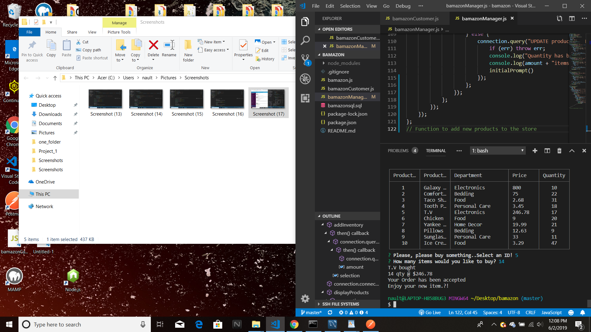
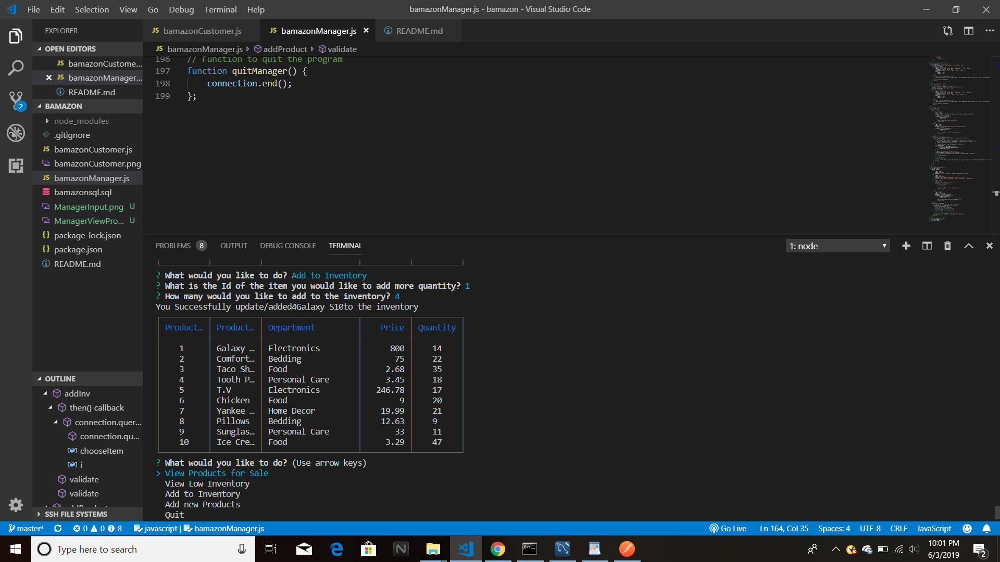
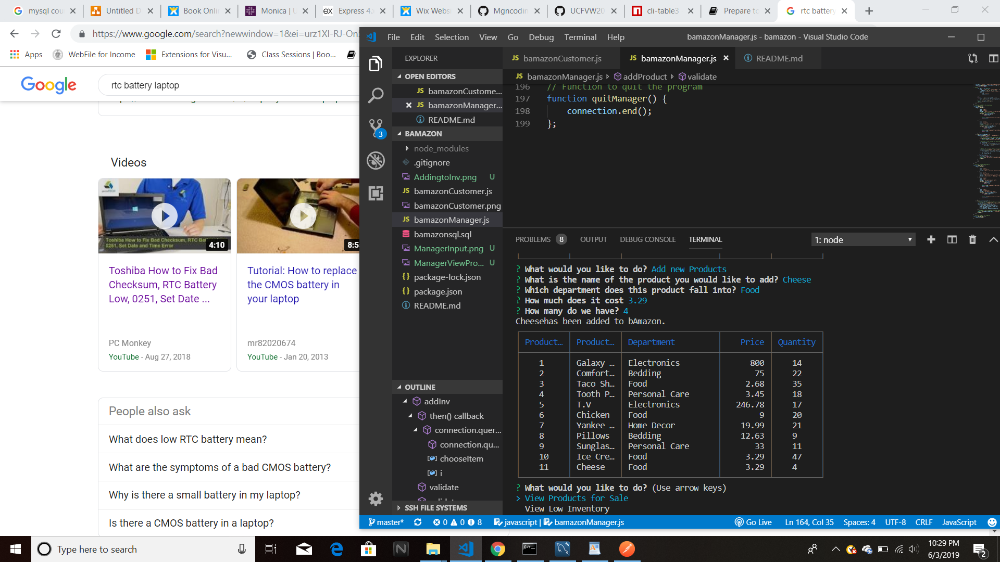
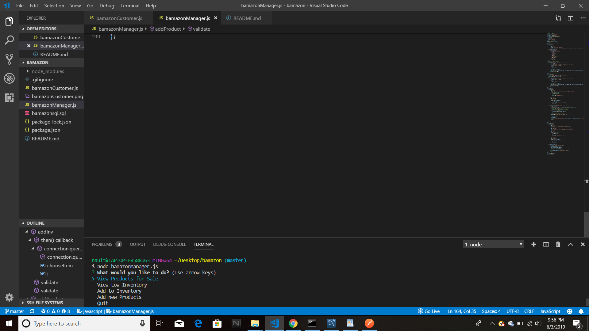
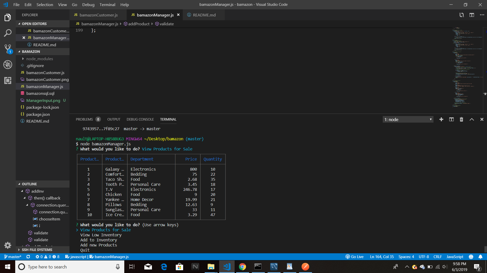

# bamazon

<!-- This is the custom view -->

<!-- Manager: Adding to Inventory -->

<!-- Manager: Adding New Product -->

<!-- Manager: Manager selection -->

<!-- Manager: View Products of current stock -->

Wasn't able to start the Third challenge. 

Also, when I add and remove products they Update, but don't stay updated in the database. I thought having the UPDATE in the query would update the table, but it doesn't save. 